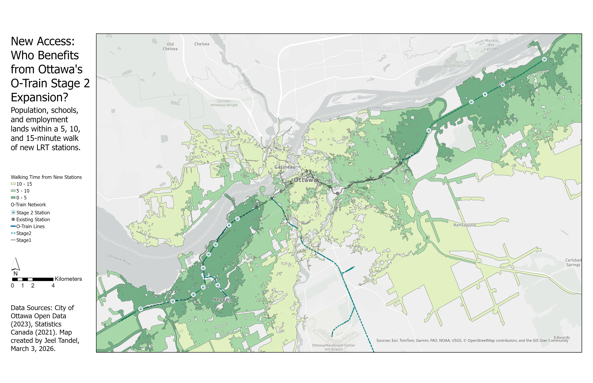

# O-Train Stage 2 Accessibility Analysis (Ottawa)

## Project Overview
This project is a comprehensive GIS analysis of the community benefits from the City of Ottawa's O-Train Stage 2 light rail transit (LRT) expansion. The goal was to move beyond simply mapping lines and stations to quantify the real-world accessibility impact for residents. The analysis identifies the population, schools, and employment areas that fall within a 5, 10, and 15-minute walking distance of the 24 new LRT stations.

**Live Demo:** [Link]((https://acgis.maps.arcgis.com/apps/mapviewer/index.html?webmap=fccb9f784b324811a708820d3a2ac352))

## Skills & Technologies Demonstrated
*   **Data Sourcing & Cleaning:** Sourcing, projecting, and cleaning open data from municipal (City of Ottawa) and federal (Statistics Canada) sources.
*   **Spatial Analysis:**
    *   **Network Analysis:** Generation of Service Area polygons (walking catchments) using ArcGIS Pro's credit-based Network Analyst services.
    *   **Overlay Analysis:** Use of Intersect, Spatial Join, and Summarize Within to aggregate demographic and land-use data into the service areas.
*   **Data Management:** Use of ArcGIS Pro's file geodatabase and exporting final data to the open-source GeoPackage format.
*   **Cartography & Data Visualization:** Design of a professional, clear, and aesthetically pleasing thematic map in ArcGIS Pro, focusing on visual hierarchy and intuitive symbology.

## Methodology

1.  **Data Acquisition:** Sourced O-Train alignment/station data, school locations, and employment lands from the City of Ottawa Open Data portal. Acquired 2021 Dissemination Area boundaries and population counts from Statistics Canada.
2.  **Data Preparation:** All datasets were projected to NAD 1983 / UTM Zone 18N. Population data was joined to DA boundaries, and a population density field was calculated.
3.  **Network Analysis:** Using only the new Stage 2 stations as inputs, the `Generate Service Areas` tool in ArcGIS Pro was run with a "Walking Time" travel mode to create 5, 10, and 15-minute walksheds.
4.  **Enrichment & Overlay:** The resulting walkshed polygons were enriched using overlay tools to calculate the total population, number of schools, and area of employment lands contained within each time-based ring.
5.  **Cartography:** A final 11x17 layout was designed with a custom color scheme, clear legend, and all necessary cartographic elements to effectively communicate the results.

## Data Sources
*   **O-Train Network & Ancillary Data:** City of Ottawa Open Data Portal (Accessed 2023).
*   **Demographic Data:** Statistics Canada, 2021 Census of Population (Accessed 2023).

## Limitations
*   The network analysis relies on the Esri street network, which may not perfectly reflect all pedestrian pathways or barriers.
*   The population is aggregated at the Dissemination Area level and is assumed to be evenly distributed within that area for proportional calculations.

---
**Created by Jeel Tandel** | [LinkedIn Profile](https://www.linkedin.com/in/jeel-tandel-6b6822294/) | [Portfolio Website](https://www.jeeltandel.com/)
